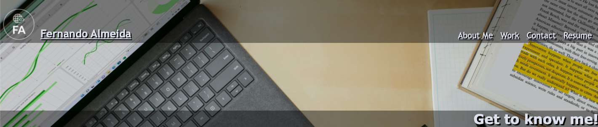
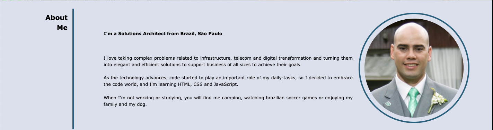
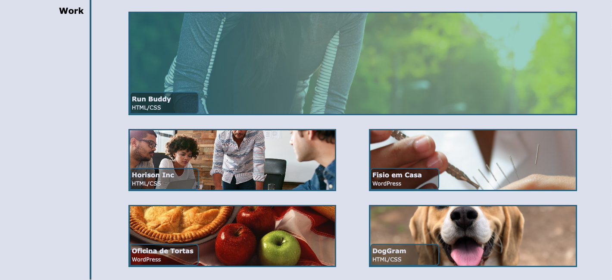
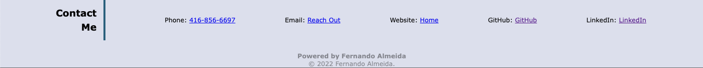

# Fernando Almeida - Portfolio.

## Purpose
A website that provides an overview about me and my work during this code learning journey at University of Toronto.

## Built With
* HTML
* CSS

## Website
https://flalmeida3105.github.io/myportfolio/

## About the Website
The website it's broken down into 3 main parts, About Me, Work, and Contact. It also holds a special link at the top right of the page, where you can download the updated version of my resume.

## Header and Hero Section - Screenshot

## About Me Section - Screenshot

## Work Section - Screenshot

## Contact Section - Screenshot

## Contribution
Powered by Fernando Almeida